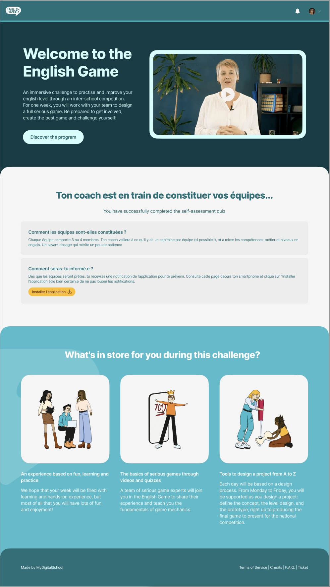

# Projet sur English Game
## Réalisation de la page English Game
*Objectif attendu :*

- faire des commits réguliers
- faire des push sur Origins

*moyen et outils :*  

création d'un compte gitUb et <ins>double authentification</ins> du compte via ce lien
[lien GitHub](https://github.com/), puis création d'une clé SSH, nous avons plusieurs site, voici un [lien en exemple](https://docs.github.com/fr/authentication/connecting-to-github-with-ssh/generating-a-new-ssh-key-and-adding-it-to-the-ssh-agent) et nous utiliserons cette ligne de commande `ssh-keygen -t ed25519 -C "your_email@example.com"` pour la générer.

## Logiciel à intaller :

- [x] Linux

Pour que la travail soit fluide, nous utilisons Linux, un OS open source. Les bases sur les lignes de commande sont à connaitre que nous pouvons trouver [ici](chrome-extension://efaidnbmnnnibpcajpcglclefindmkaj/https://cdn.hostinger.com/tutorials/pdf/Linux-Commands-Cheatsheet-FR.pdf). Thomas notre formateur nous préconise de les utiliser régulièrement pour se les approprier.

- [x] VScode

pour réaliser la page, nous utilisons VS Code

une fois les étapes réalisés, le TP sera terminé
- [x] installer Linux
- [ ] creer une clé SSH
- [ ] Réaliser la page sous VSCode

Nous devons repliquer cette page :  
